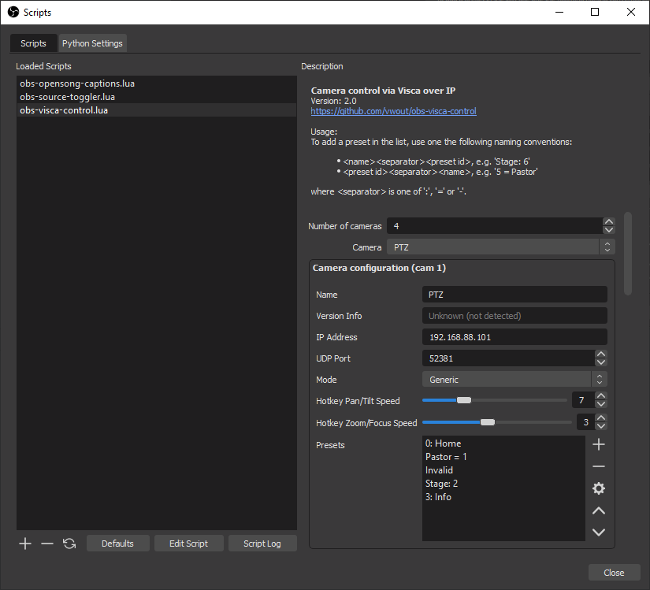
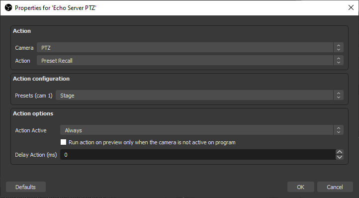

# obs-visca-control
A plugin for [OBS](https://obsproject.com/) to control Visca-over-IP based cameras.

This plugin adds a source to a scene in OBS. With this source, a camera can be controlled.
Its main purpose is to automatically switch a camera to a certain preset when the scene is activated.
This activation can be as soon as the scene is active in preview, in program, or both.

Besides recalling a pre-made preset, this plugin supports a few more control operations:
- Switch camera On
- Switch camera Off
- Preset Recall
- Zoom (Stop, In - Tele, Out - Wide, Direct)
- Pan/Tilt (Up, Down, Left, Right, Upleft, Upright, Downleft, Downright, Stop, Home, Reset)

This plugin requires the camera to support Visca over IP.
It follows the specification as designed by Sony.
This plugin has been tested with Everet cameras and is also reported to work with Avonic, BZB Gear and Zowietek cameras.

## Installation
The plugin is a script plugin and utilizes the Lua scripting capabilities of OBS.
To use the plugin, add the file `obs-visca-control.lua` as a script, see below for a detailed instruction.
The other `.lua` files in this repository are also required, but should not be added as scripts in OBS.

The files needed for usage if this plugin are:
- `obs-visca-control.lua`: The main OBS plugin file
- `libvisca.lua`: Internal library that implements the Visca communication
- `ljsocket.lua`: Network (socket) communication library for use with LuaJIT in OBS

Place the files on your computer, e.g. in `data\obs-plugins\frontend-tools\scripts\` under your OBS installation folder. 
In OBS choose *Scripts* in the *Tools* menu and click the "+" symbol. Navigate to the location where `obs-visca-control.lua` is stored and confirm with 'Open'. The plugin settings will show on the right as described in the below.

## Configuration
Before the plugin can be used in a scene, it requires configuration in the `Script` dialog.

Start by enumerating the number of cameras cameras that you want to control.
For each camera a set of configuration properties will be shown:
- Name: A friendly name for easy recognition of the camera
- Address: The IP address at which the camera is available.
- Port: The plugin by default uses _UDP_ port `52381`. Change this port when needed, e.g. to `1259` for a PTZOptics camera.
- Mode: The operating mode of the plugin. The default is `Generic`, which follows the original (Sony) Visca specification. Other supported modes are `PTZOptics`, to send commands according the PTZOptics Visca protocol.
- The list of presets that you want to configure for the camera

Switch between cameras using the drop-down.
Reload the plugin to update the names of the cameras in the camera drop-down list.

The preset list contains one preset per line and contains the name for the preset and the number of the preset stored in the camera.
The preset follows a specific syntax to link a preset number to a name. The following forms are supported:
- `<name>` `<separator>` `<preset number>`
- `<preset number>` `<separator>` `<name>`

The separator can be `:`, `=` or `-`.
Valid examples are `0: Home`, `5 = Pastor` or `Stage - 6`

## Usage
To control a camera, add a `Visca Camera Control` source to a scene.

In the source settings, select the camera, action and optionally the preset that the camera should switch to.
The camera action is executed when either the scene in which the source is used becomes active in preview, in program, or both, depending on the selected entry in the selection.

# Credits
This plugin uses [luajitsocket](https://github.com/CapsAdmin/luajitsocket/), a library that implements socket support for LuaJIT, since the Lua socket library is not available in OBS.